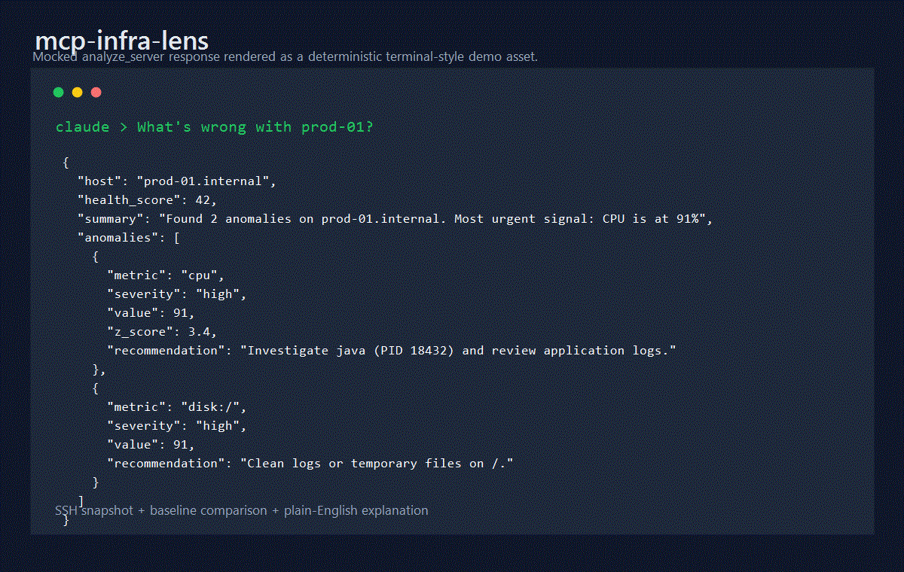

# mcp-infra-lens

Explain Linux incidents over SSH with baseline-aware MCP tooling.

[](https://www.npmjs.com/package/mcp-infra-lens)
[](https://www.npmjs.com/package/mcp-infra-lens)
[](./LICENSE)
[](https://nodejs.org/)
[](https://www.npmjs.com/package/@modelcontextprotocol/sdk)

`mcp-infra-lens` is a TypeScript MCP server that connects to Linux hosts over SSH, captures live metrics, stores local SQLite history, compares snapshots to baselines, and returns plain-English infrastructure explanations.

## Demo



## Tools

| Tool | Purpose |
| --- | --- |
| `analyze_server` | Collect a sampled snapshot, store it, and explain anomalies |
| `snapshot` | Store a point-in-time snapshot without anomaly analysis |
| `record_baseline` | Save a labeled healthy-state sample |
| `compare_to_baseline` | Compare current state with a named baseline |
| `get_history` | Return CPU, memory, or load history from SQLite |

## Requirements

- Node.js 24 LTS for CI, Docker, and release workflows
- Node.js 22 or newer for package runtime compatibility
- pnpm 11.3.0 through Corepack for development installs
- Linux SSH targets with `/proc`, `free`, `df`, `ps`, and `uname`
- Strict SSH host verification through `known_hosts` or pinned SHA256 host keys

## Quick Start

Run the stdio MCP server from npm:

```bash
npx -y mcp-infra-lens
```

Desktop MCP client style configuration:

```json
{
  "mcpServers": {
    "infra-lens": {
      "command": "npx",
      "args": ["-y", "mcp-infra-lens"],
      "env": {
        "INFRA_LENS_DB": "/Users/you/.mcp-infra-lens/metrics.db"
      }
    }
  }
}
```

Local development:

```bash
corepack enable
corepack prepare pnpm@11.3.0 --activate
pnpm install --frozen-lockfile
pnpm run build
node dist/mcp.js
```

## Configuration

| Variable | Default | Description |
| --- | --- | --- |
| `MCP_TRANSPORT` | `stdio` | Intended transport mode: `stdio` or `http` |
| `INFRA_LENS_DB` | `~/.mcp-infra-lens/metrics.db` | SQLite database path |
| `MCP_HTTP_HOST` | `127.0.0.1` | HTTP bind host. `HOST` remains a deprecated alias |
| `MCP_HTTP_PORT` | `3000` | HTTP bind port. `PORT` remains a deprecated alias |
| `MCP_HTTP_ALLOWED_ORIGINS` | unset | Comma-separated allowed Origin values |
| `MCP_HTTP_ALLOWED_HOSTS` | unset | Comma-separated allowed Host values |
| `MCP_HTTP_AUTH_MODE` | `none` | `none`, `bearer`, or `oauth` |
| `MCP_HTTP_BEARER_TOKEN` | unset | Local/dev bearer fallback token |
| `MCP_HTTP_BODY_LIMIT_BYTES` | `1048576` | Maximum JSON request body size |
| `MCP_HTTP_AUTHORIZATION_SERVERS` | unset | OAuth authorization server metadata URLs |
| `MCP_PROFILE` | `full` | `full`, `remote-safe`, `chatgpt`, or `claude` |
| `MCP_SSH_STRICT_HOST_CHECKING` | `true` | Strict host key verification toggle |
| `MCP_SSH_KNOWN_HOSTS` | `~/.ssh/known_hosts` | Known hosts file |
| `MCP_SSH_ALLOWED_HOSTS` | unset | Required host allowlist for remote-safe profiles |

`MCP_DB_PATH` from older examples is not used; use `INFRA_LENS_DB`.

## SSH Security

Strict host key checking is enabled by default. Provide either:

- a `hostKeySha256` value in the connection input, such as `SHA256:...`
- a `knownHostsPath` in the connection input
- `MCP_SSH_KNOWN_HOSTS` pointing at an OpenSSH `known_hosts` file

Raw passwords, private keys, and passphrases are accepted only in the default `full` profile for trusted local MCP contexts. `remote-safe`, `chatgpt`, and `claude` profiles reject raw SSH credentials in tool input and require `MCP_SSH_ALLOWED_HOSTS`.

Process command arguments are not collected by the default process command. Secret-like values in process data, SSH errors, and logs are redacted before storage or output.

## HTTP Transport

Run the Streamable HTTP transport locally:

```bash
MCP_TRANSPORT=http MCP_HTTP_HOST=127.0.0.1 MCP_HTTP_PORT=3000 node dist/server-http.js
```

Loopback HTTP can run without auth for local development. Any non-loopback bind, such as `0.0.0.0`, fails fast unless all of these are configured:

- `MCP_PROFILE=remote-safe`, `chatgpt`, or `claude`
- `MCP_HTTP_AUTH_MODE=bearer` or `oauth`
- `MCP_HTTP_ALLOWED_ORIGINS`
- `MCP_HTTP_ALLOWED_HOSTS`

OAuth validation is not implemented inside this package. Public deployments should place the server behind a production OAuth-aware gateway or reverse proxy. Connector publication readiness is therefore marked false in `mcp.json`.

## Docker

The Docker image defaults to stdio mode:

```bash
docker build -t mcp-infra-lens .
docker run --rm -it \
  -v "$HOME/.mcp-infra-lens:/home/appuser/.mcp-infra-lens" \
  mcp-infra-lens
```

For local HTTP testing, override the command and keep the bind host on loopback unless a remote-safe profile and auth controls are configured:

```bash
docker run --rm -p 127.0.0.1:3000:3000 \
  -e MCP_TRANSPORT=http \
  -e MCP_HTTP_HOST=0.0.0.0 \
  -e MCP_HTTP_ALLOWED_ORIGINS=http://localhost:3000 \
  -e MCP_HTTP_ALLOWED_HOSTS=localhost:3000 \
  -e MCP_HTTP_AUTH_MODE=bearer \
  -e MCP_HTTP_BEARER_TOKEN=local-dev-token \
  mcp-infra-lens node dist/server-http.js
```

## Development

```bash
pnpm run format:check
pnpm run lint
pnpm test
pnpm run test:coverage
pnpm run build
pnpm run check:metadata
pnpm run package:dry-run
```

Docker-backed SSH e2e validation:

```bash
docker compose -f docker-compose.test.yml up -d --build
pnpm run test:e2e
docker compose -f docker-compose.test.yml down --volumes
```

See [docs/testing.md](./docs/testing.md), [docs/security.md](./docs/security.md), [docs/operations.md](./docs/operations.md), and [docs/release.md](./docs/release.md) for the full operational workflow.

## Release

Releases are managed through release-please manifest mode and the guarded GitHub Actions release workflow. Implementation PRs must not publish packages, containers, MCP Registry entries, marketplace artifacts, or production GitHub Releases.

See [docs/release.md](./docs/release.md) and [docs/release-state-machine.md](./docs/release-state-machine.md).

## License

[MIT](./LICENSE)
